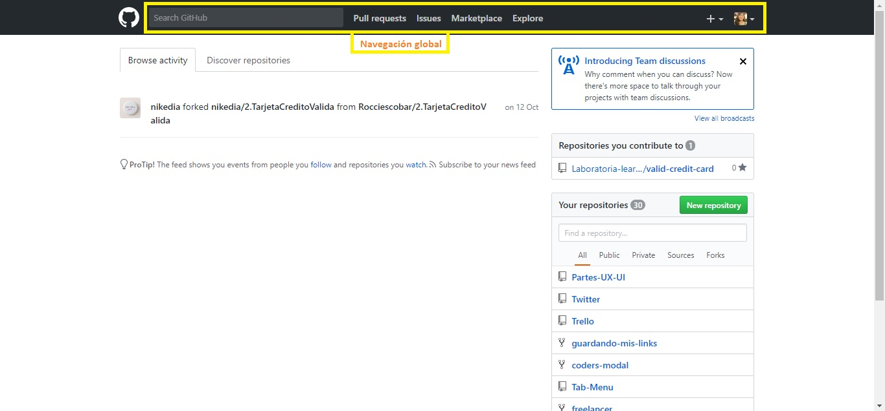
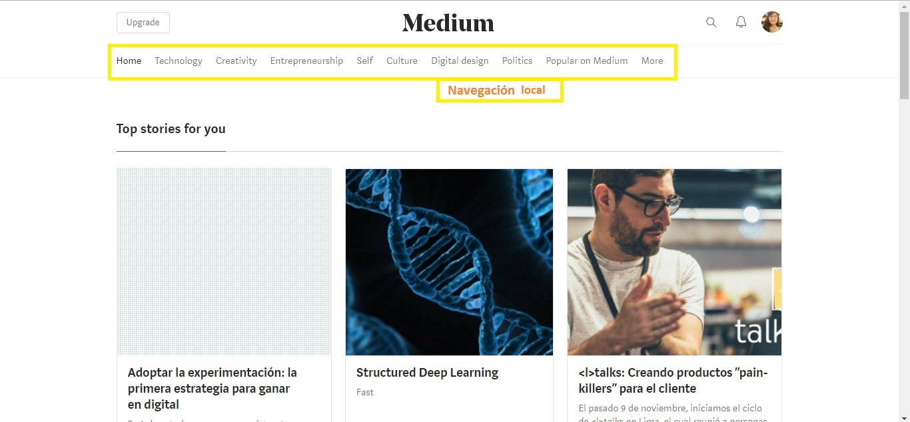

Reto - Elementos de Navegación
============================

OBJETIVO
--------
Este reto consiste en identificar los elementos de navegación en los siguientes sites:

* Breather
* Github
* Medium

DESARROLLO
----------

## **1. Breather**

**1.1. Navegación Global**

**1.2. Navegación Local**

**1.3. Navegación Filtrada**

**1.4. Navegación En línea**

## **2. Github**

**2.1. Navegación Global**

**2.2. Navegación Local**

**2.3. Navegación Facetada**

**2.4. Navegación Filtrada**

**2.5. Navegación Contextual**

**2.6. Navegación en Línea**

## **3. Medium**

**3.1. Navegación Global**

**3.2. Navegación Local**

**3.3. Navegación Facetada**

**3.4. Navegación Contextual**

**3.5. Navegación en Línea**

